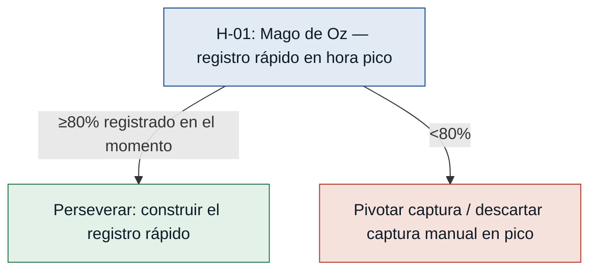

# Hipótesis y experimentos — CafeStock

Cada experimento es **comprar información barata** sobre el riesgo más grande antes
de construir. Las test cards van de **mayor a menor riesgo**: primero lo que más
puede tumbar el MVP. Riesgo = impacto de equivocarse × incertidumbre.

> Nota: H-01 y H-02 son las de mayor riesgo porque sostienen toda la cadena de
> valor. Si el empleado no registra en el momento (H-01) o el descuento por receta
> no estima bien el consumo (H-02), las alertas (H-03/H-04) operan sobre datos
> falsos y el MVP no entrega su propuesta.

---

### [H-01] El empleado registra la venta en el momento — riesgo: alto
- **Supuesto a probar:** el empleado de ventas registrará cada venta en el momento durante la hora pico. Es el salto de fe que sostiene todo: sin registro en el momento no hay descuento de insumos ni alertas confiables.
- **Hipótesis:** Creemos que el empleado de ventas registrará la venta en el momento si el registro toma pocos segundos y no lo saca de atender, porque su dolor declarado es justamente que "después lo anoto" y se olvida.
- **Señal medible:** % de ventas registradas en el momento (vs. reconstruidas al cierre) durante la franja pico de la mañana.
- **Criterio de éxito:** ≥ 80% de las ventas de la franja pico registradas en el momento, sostenido durante 5 días pico consecutivos.
- **Experimento:** Mago de Oz — durante 1 semana el empleado usa una pantalla simple de registro rápido (o una planilla/contador atendido por detrás) y se compara, por conteo de tickets/observación, lo registrado en el momento vs. al cierre.
- **Caja de tiempo/costo:** 1 semana de operación, ~4 h de montaje y observación; sin construir el sistema.
- **Regla de decisión:** Si pasa (≥80%) → perseverar: construir el registro rápido como núcleo. Si falla (<80%) → pivotar el mecanismo de captura (registro por lotes entre clientes, captura asistida); si ni así sube, descartar la captura manual en pico.

### [H-02] El descuento por receta estima bien el consumo — riesgo: alto
- **Supuesto a probar:** las recetas de insumos por producto son lo bastante estables para estimar el consumo real con precisión útil.
- **Hipótesis:** Creemos que descontar insumos por receta al vender estimará el stock real con error bajo si las porciones son consistentes, porque los productos clave (café con leche, capuchino) usan cantidades repetibles de leche y café.
- **Señal medible:** desviación entre el stock estimado por el descuento por receta y el conteo físico real de los insumos clave (leche, café), al cierre.
- **Criterio de éxito:** desviación ≤ 10% en leche y café medida al cierre, durante 5 días.
- **Experimento:** Concierge — durante 5 días se calcula a mano el descuento por receta sobre las ventas y se contrasta con un conteo físico real al cierre de leche y café. No se construye nada.
- **Caja de tiempo/costo:** 5 días, ~30 min/día de conteo; tiempo del encargado de compras.
- **Regla de decisión:** Si pasa (≤10%) → perseverar con descuento por receta. Si falla (>10%) → pivotar a recetas calibradas o conteo periódico asistido; si el error es irreducible, descartar la estimación por receta como base de las alertas.

### [H-03] La alerta se traduce en reposición a tiempo — riesgo: medio
- **Supuesto a probar:** una alerta de stock bajo cambia el comportamiento (reponen antes del quiebre), no solo informa.
- **Hipótesis:** Creemos que el equipo repondrá antes del quiebre si recibe una alerta proactiva al cruzar el mínimo, porque hoy el quiebre ocurre por no enterarse a tiempo, no por falta de voluntad de reponer.
- **Señal medible:** % de alertas de stock bajo que terminan en reposición del insumo ANTES de que se agote durante el horario.
- **Criterio de éxito:** ≥ 70% de las alertas resueltas con reposición antes del quiebre, durante 2 semanas.
- **Experimento:** Mago de Oz — durante 2 semanas, cuando el stock estimado a mano cruce el mínimo se envía una alerta manual por WhatsApp al encargado; se registra si repuso antes de agotarse.
- **Caja de tiempo/costo:** 2 semanas, monitoreo manual diario (~15 min/día).
- **Regla de decisión:** Si pasa (≥70%) → perseverar: la alerta es la pieza de valor. Si falla (<70%) → pivotar el canal/anticipación (más margen antes del mínimo, asignar responsable) o descartar que basta informar para que repongan.

### [H-04] Los mínimos por experiencia generan alertas útiles — riesgo: medio
- **Supuesto a probar:** los mínimos fijados "por experiencia" producen alertas accionables y no ruido (falsas alarmas que se terminan ignorando).
- **Hipótesis:** Creemos que los mínimos definidos por el encargado producirán alertas accionables si reflejan su experiencia real del consumo, porque ya decide compras con ese criterio aunque sin datos.
- **Señal medible:** % de falsas alarmas: alertas disparadas que NO correspondían a un riesgo real de quiebre en los días siguientes.
- **Criterio de éxito:** ≤ 20% de falsas alarmas sobre el total de alertas emitidas, durante 2 semanas.
- **Experimento:** Concierge — durante 2 semanas se emiten alertas según los mínimos propuestos y se clasifica cada una como acertada o falsa alarma, contrastando con el consumo observado.
- **Caja de tiempo/costo:** 2 semanas, ~10 min/día de clasificación; puede correr en paralelo con H-03.
- **Regla de decisión:** Si pasa (≤20%) → perseverar: los mínimos por experiencia sirven de punto de partida. Si falla (>20%) → pivotar a mínimos calibrados con el consumo medido (de H-02); si siguen siendo ruido, descartar el umbral fijo y replantear la regla de alerta.

---

## Árbol de decisión del experimento #1 (el de mayor riesgo)

