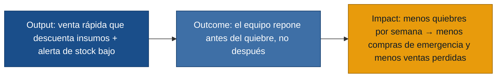

# MVP Canvas — CafeStock

El núcleo de valor que se repite en las tres personas es la cadena: **registrar la
venta rápido → descontar los insumos automáticamente → alertar antes de que el
producto se acabe**. El MVP ataca eso y deja fuera todo lo demás.

## MVP Canvas — CafeStock

| Bloque | Contenido |
|---|---|
| Propuesta de valor | Que una cafetería pequeña deje de quedarse sin insumos clave por sorpresa: registrar la venta en segundos descuenta el inventario solo y avisa antes del quiebre. |
| Segmento de usuarios | Cafeterías pequeñas. Personas primarias: empleado de ventas (registra), encargado de compras (configura mínimos y repone), dueño (revisa el cierre). |
| Funcionalidades mínimas | (US-01) registro rápido de venta; (US-02) descuento automático de insumos por receta; (US-03) alerta de stock bajo; (US-05) mínimos por insumo; (US-06) registro de entradas de inventario; (US-04) resumen de ventas del día. |
| Resultado esperado (outcome) | El equipo se entera de un insumo bajo **antes** de que se agote y repone a tiempo, en lugar de descubrirlo cuando ya no hay y salir a comprar de emergencia. |
| Métrica de éxito | Nº de quiebres de stock de insumos clave por semana (eventos "se acabó durante el horario"). Prueba ácida: si baja, el dueño deja de hacer compras de emergencia y de perder ventas; si no baja, el MVP no resolvió el dolor. |
| Riesgos / supuestos | (1) El empleado registrará la venta en hora pico aunque cueste segundos. (2) Las recetas de insumos por producto son lo bastante estables para estimar el consumo. (3) Una alerta de stock bajo se traduce en una reposición a tiempo. (4) Los mínimos fijados "por experiencia" son útiles, no ruido. |
| Fuera de alcance (por ahora) | Reportes de rotación por día/semana (US-07) y sugerencia automática de compra (US-08): valiosos, pero el núcleo es evitar el quiebre, no optimizar la compra. Conciliación de pagos efectivo/transferencia (R-07), integración con proveedores, multi-local y contabilidad. |

## Cadena output → outcome → impact

> **Gate de readiness:** las tres personas del segmento tienen entrevista de
> primera mano y los dolores que sustenta el MVP están trazados en
> `evidence-map.json`. No hay supuestos inventados; los riesgos quedan listados
> arriba para validarse en `/discovery:experiments`.
