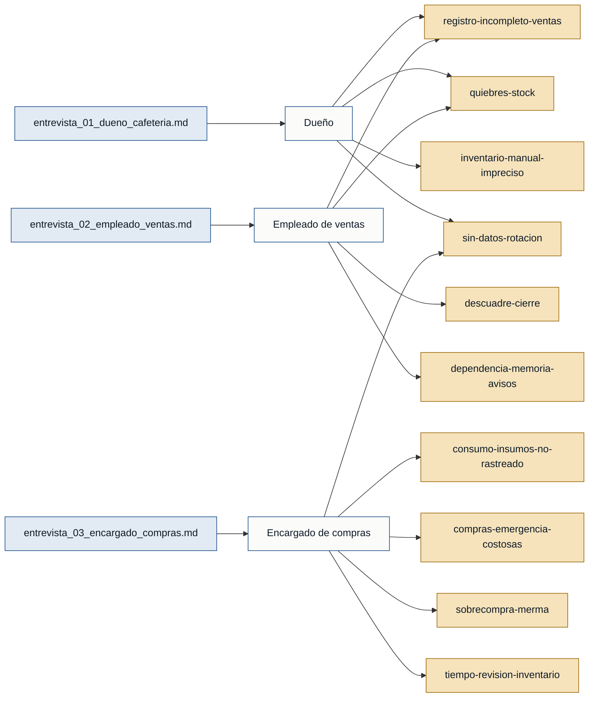

# Personas y stakeholders — CafeStock

Evidencia: 3 entrevistas en `discoveries/cafestock/interviews/`, todas en primera
persona. Cada afirmación cita su archivo fuente.

## Personas

### Dueño de cafetería — dueno_negocio
- **Contexto:** propietario de una cafetería pequeña que controla ventas e inventario de forma manual (Excel y revisión visual).
- **Objetivo principal:** tener control de ventas, consumo de insumos y productos por acabarse sin depender de la memoria ni de cuadrar todo al final del día.
- **Dolores:**
  - Las ventas no siempre se registran en el momento; se cuadra al cierre (entrevista_01_dueno_cafeteria.md).
  - Quiebres de stock de productos clave (se acabó la leche un sábado antes del mediodía) (entrevista_01_dueno_cafeteria.md).
  - Inventario manual e impreciso: no hay dato exacto de cuánto queda (entrevista_01_dueno_cafeteria.md).
  - Sin datos de rotación: solo "una idea general" de los más vendidos (entrevista_01_dueno_cafeteria.md).
  - Incertidumbre sobre si se compra bien o se gasta de más (entrevista_01_dueno_cafeteria.md).
- **Respaldo:** `primera mano` (entrevista_01_dueno_cafeteria.md).

### Empleado de ventas — empleado_ventas
- **Contexto:** atiende, cobra y entrega pedidos, sobre todo en las horas pico de la mañana.
- **Objetivo principal:** registrar lo vendido de forma rápida y que el inventario se actualice solo, sin frenar la atención al cliente.
- **Dolores:**
  - Registro incompleto de ventas en horas de alta demanda ("después lo anoto" y se olvida) (entrevista_02_empleado_ventas.md).
  - Descuadre al cierre entre lo vendido y el dinero recibido (entrevista_02_empleado_ventas.md).
  - Avisos de stock bajo son verbales o por WhatsApp; si nadie se da cuenta, el producto se acaba (entrevista_02_empleado_ventas.md).
  - Todo el proceso depende de "acordarse" (anotar, avisar, revisar) (entrevista_02_empleado_ventas.md).
- **Respaldo:** `primera mano` (entrevista_02_empleado_ventas.md).

### Encargado de compras e inventario — encargado_compras
- **Contexto:** decide qué comprar basándose en lo que falta y en la semana anterior; lleva un Excel parcial de compras.
- **Objetivo principal:** conectar las ventas con el inventario para estimar consumo, fijar mínimos de stock y comprar antes de quedarse sin producto.
- **Dolores:**
  - Las salidas de inventario no se registran; el stock real no coincide con lo esperado (entrevista_03_encargado_compras.md).
  - Sobrecompra (producto acumulado, perecibles que se dañan) y subcompra (compras de emergencia más caras) (entrevista_03_encargado_compras.md).
  - Sin reporte de rotación por día/semana; decide "por experiencia" (entrevista_03_encargado_compras.md).
  - Revisar inventario y compras toma de 30 min a 1 h, más si algo no cuadra (entrevista_03_encargado_compras.md).
- **Respaldo:** `primera mano` (entrevista_03_encargado_compras.md).

## Stakeholders

### Dueño del negocio
- **Interés en el sistema:** proteger el margen (no perder ventas por quiebres, no gastar de más en compras) y tomar mejores decisiones con datos de ventas e inventario.
- **Fuente:** entrevista_01_dueno_cafeteria.md.

### Proveedores
- **Interés en el sistema:** reciben los pedidos de la cafetería; un mejor control de compras cambia frecuencia y volumen de los pedidos. Mencionados como "Proveedor 1" y "Proveedor 2", no entrevistados.
- **Fuente:** entrevista_03_encargado_compras.md.

### Clientes de la cafetería
- **Interés en el sistema:** encontrar disponible lo que piden; los quiebres de stock hacen que a veces se vayan sin comprar. Mencionados, no entrevistados.
- **Fuente:** entrevista_01_dueno_cafeteria.md, entrevista_02_empleado_ventas.md.

## Mapa de trazabilidad

> Las tres personas tienen respaldo de **primera mano**. No hay personas
> primarias solo `referenciadas`, por lo que no hay bloqueo de readiness por
> falta de evidencia de roles.
